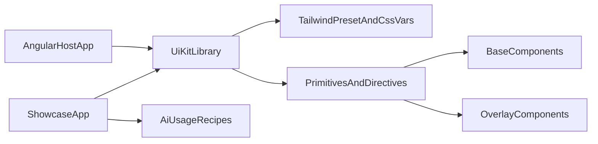

# Piano UI Kit Angular + Tailwind (AI-first)

## Obiettivo
Creare una libreria UI riusabile per progetti Angular con stile Tailwind, API coerente, accessibilita` di base, e una roadmap incrementale sui componenti richiesti.

## Scelte confermate
- Struttura: Angular library singola + app demo/docs.
- Dipendenze: approccio proprietario con dipendenze esterne minime e mirate per i casi complessi.

## Architettura proposta
- `projects/ui-kit/`: libreria Angular (`@your-scope/ui-kit`) con componenti, direttive, tokens e utility.
- `apps/showcase/`: app demo per documentare API, stati, varianti e snippet AI-friendly.
- Tema Tailwind condiviso tramite preset/tokens CSS variables, consumabile da host app.
- Componenti separati in:
  - **Base/Form**: input, textarea, checkbox, switch, radio, badge, alert, progress, spinner.
  - **Navigation**: breadcrumb, tabs, pagination, dropdown.
  - **Overlay/Complex**: dialog, alert-dialog, accordion, collapsible, combobox, select-search, typeahead, datepicker.

## File/struttura da introdurre (fase bootstrap)
- Workspace Angular:
  - [`angular.json`](angular.json)
  - [`package.json`](package.json)
  - [`tsconfig.base.json`](tsconfig.base.json)
- Libreria:
  - [`projects/ui-kit/src/public-api.ts`](projects/ui-kit/src/public-api.ts)
  - [`projects/ui-kit/src/lib/index.ts`](projects/ui-kit/src/lib/index.ts)
  - [`projects/ui-kit/src/lib/core/tokens.ts`](projects/ui-kit/src/lib/core/tokens.ts)
  - [`projects/ui-kit/src/lib/core/class-variants.ts`](projects/ui-kit/src/lib/core/class-variants.ts)
- Tailwind/theming:
  - [`tailwind.config.ts`](tailwind.config.ts)
  - [`projects/ui-kit/src/styles/ui-kit.css`](projects/ui-kit/src/styles/ui-kit.css)
  - [`projects/ui-kit/src/styles/theme.css`](projects/ui-kit/src/styles/theme.css)
- Demo/docs:
  - [`apps/showcase/src/app/routes.ts`](apps/showcase/src/app/routes.ts)
  - [`docs/components/*.md`](docs/components)

## Strategia componenti (incrementale)
1. **Foundation (MVP veloce)**
   - Badge, Alert, Spinner/Loading, Progress.
   - Input, Input Group, Label, Textarea, Checkbox, Switch, Radio Group.
   - Tabs, Breadcrumb, Pagination (versione base).
2. **Interazioni medie**
   - Accordion, Collapsible, Dropdown Menu, Dialog, Alert Dialog.
3. **Componenti data-entry avanzati**
   - Combobox, Select con ricerca, Typeahead, Datepicker.

## Pattern tecnici chiave
- API uniforme per tutti i componenti:
  - `variant`, `size`, `state`, `disabled`, `invalid`, `loading`.
- Composizione “headless + classi Tailwind”:
  - logica comportamento in direttive/servizi.
  - stile in class map centralizzate (`class-variants.ts`).
- Accessibilita`:
  - ruoli ARIA, keyboard navigation, focus management.
- Stabilita` AI-first:
  - naming prevedibile (`UiXxxComponent`, `UiXxxDirective`).
  - esempi minimi per ogni componente con use-case standard.

## Dipendenze esterne minime suggerite
- `@angular/cdk`: overlay, focus trap, a11y utilities.
- Datepicker (opzione mirata): valutare `flatpickr` wrapper leggero o implementazione base custom con CDK overlay.
- Nessuna dipendenza UI completa (niente framework component library full).

## Test e quality gate
- Unit test per stato, eventi, keyboard navigation.
- Test integrazione su componenti overlay/complessi.
- Checklist a11y minima su demo app.
- Build libreria + smoke test install in progetto Angular esterno.

## Distribuzione e versioning
- Output package npm privato/pubblico (`@your-scope/ui-kit`).
- Semantic versioning con changelog.
- Documentazione componenti con snippet “copy/paste” per AI coding.

## Skill AI consigliate
Creare skill di progetto dedicate per velocizzare evoluzione della UI kit:
- [`/.cursor/skills/angular-ui-kit-component/SKILL.md`](.cursor/skills/angular-ui-kit-component/SKILL.md)
  - genera/scaffold nuovo componente con struttura standard (component + story/demo + test + export).
- [`/.cursor/skills/angular-ui-kit-a11y-check/SKILL.md`](.cursor/skills/angular-ui-kit-a11y-check/SKILL.md)
  - checklist ARIA/keyboard/focus per ogni componente interattivo.
- [`/.cursor/skills/angular-ui-kit-docs/SKILL.md`](.cursor/skills/angular-ui-kit-docs/SKILL.md)
  - aggiorna docs e snippet usage in modo coerente.

## Milestone suggerite
- **M1 (1-2 settimane):** setup libreria, theming, foundation components.
- **M2 (1-2 settimane):** dialog/dropdown/accordion/collapsible + test.
- **M3 (2 settimane):** combobox/select-search/typeahead/datepicker.
- **M4 (continuo):** hardening a11y, docs AI-first, release pipeline.
